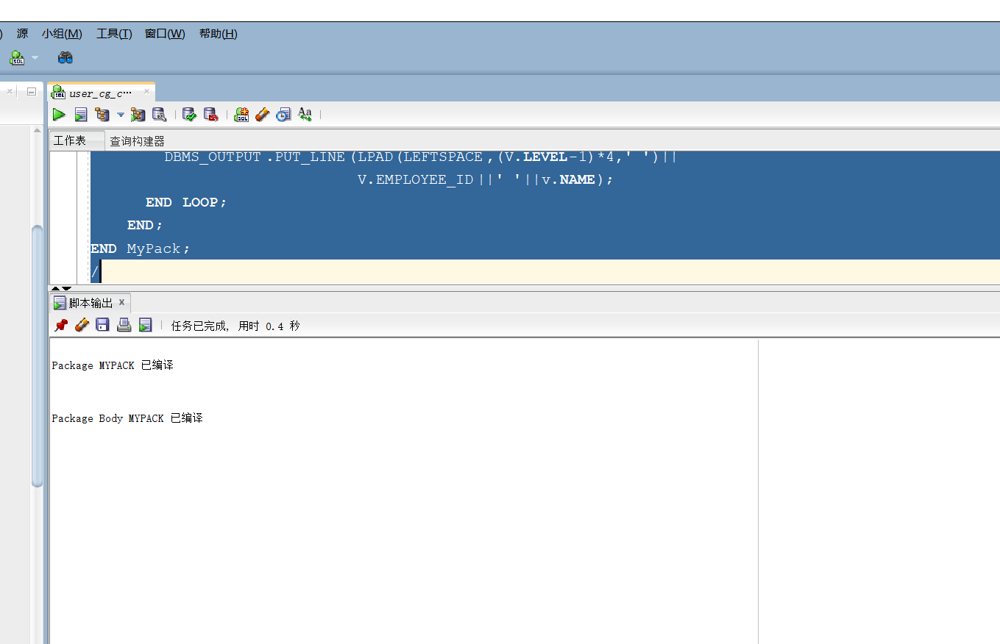
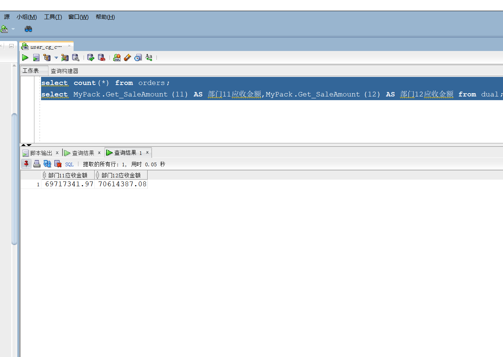
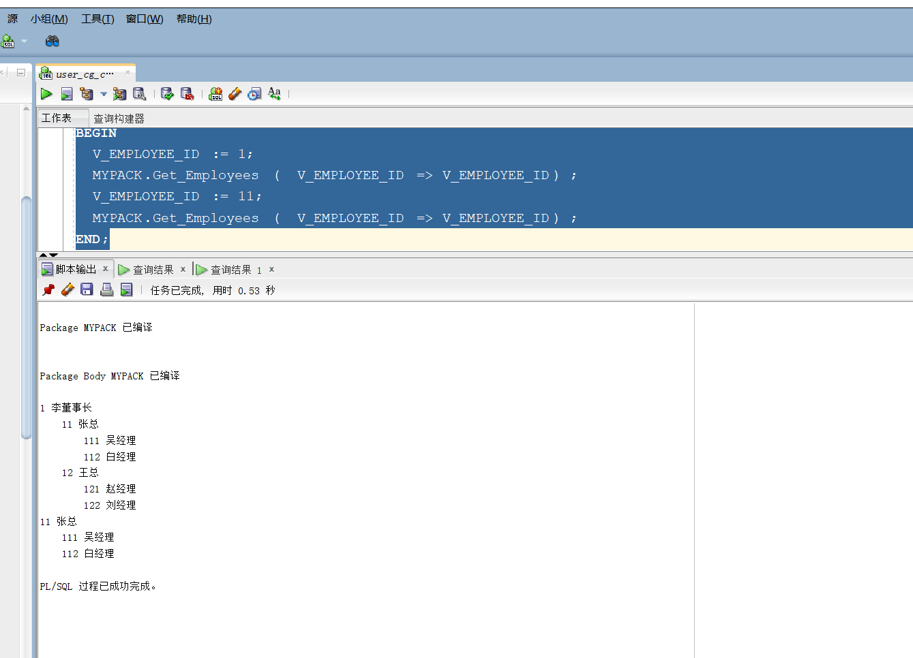
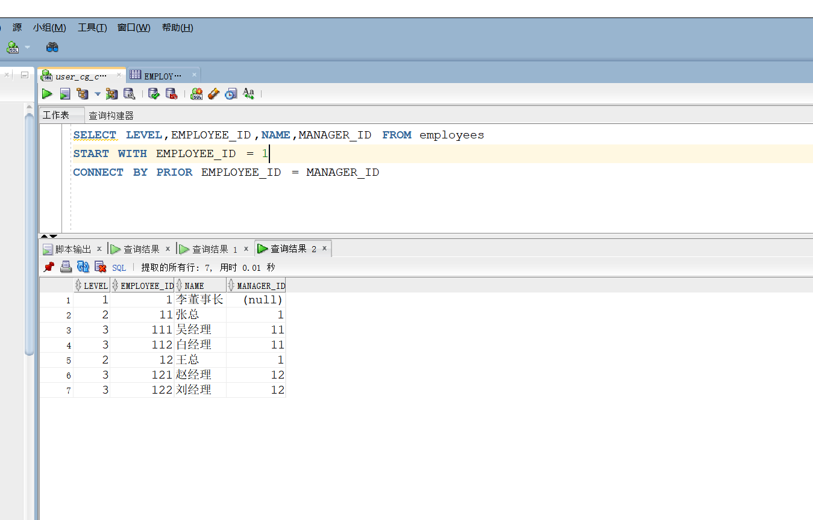

# 实验5：PL/SQL编程
##### 姓名：黄梁文韬
##### 学号：201810414114
##### 班级：18软工1班
### 1.实验目的:
- 了解PL/SQL语言结构
- 了解PL/SQL变量和常量的声明和使用方法
- 学习条件语句的使用方法
- 学习分支语句的使用方法
- 学习循环语句的使用方法
- 学习常用的PL/SQL函数
- 学习包，过程，函数的用法。
### 2.实验场景：
- 假设有一个生产某个产品的单位，单位接受网上订单进行产品的销售。通过实验模拟这个单位的部分信息：员工表，部门表，订单表，订单详单表。
- 本实验以实验四为基础
### 3.实验内容:

1. 创建一个包(Package)，包名是MyPack。

2. 在MyPack中创建一个函数SaleAmount ，查询部门表，统计每个部门的销售总金额，每个部门的销售额是由该部门的员工(ORDERS.EMPLOYEE_ID)完成的销售额之和。函数SaleAmount要求输入的参数是部门号，输出部门的销售金额。

3. 在MyPack中创建一个过程，在过程中使用游标，递归查询某个员工及其所有下属，子下属员工。过程的输入参数是员工号，输出员工的ID,姓名，销售总金额。信息用dbms_output包中的put或者put_line函数。输出的员工信息用左添加空格的多少表示员工的层次（LEVEL）。比如下面显示5个员工的信息：

4. 由于订单只是按日期分区的，上述统计是全表搜索，因此统计速度会比较慢，如何提高统计的速度呢？

```text
ID 姓名 销售总金额
=======================
2  张三  5000元
   3 李四   6000元
   4 王五   1000元
      5 孙强  2000元
6  赵强东 5000 元
```
上述输出结果表示 2，6号两个员工是一个级别的，没有领导，3，4号员工的领导是2号，5号员工的领导是4号。 Oracle递归查询的语句格式是：

```text
```sql
SELECT LEVEL,EMPLOYEE_ID,NAME,MANAGER_ID FROM employees 
START WITH EMPLOYEE_ID = V_EMPLOYEE_ID 
CONNECT BY PRIOR EMPLOYEE_ID = MANAGER_ID
```

### 4.实验步骤及截图
#### 步骤①创建一个包(Package)，包名是MyPack：
要求至少有1万个订单，每个订单至少有4个详单。至少有两个部门，每个部门至少有1个员工，其中只有一个人没有领导，一个领导至少有一个下属，并且它的下属是另一个人的领导（比如A领导B，B领导C）。

#### 步骤②在MyPack中创建一个函数SaleAmount ：
查询部门表，统计每个部门的销售总金额，每个部门的销售额是由该部门的员工(ORDERS.EMPLOYEE_ID)完成的销售额之和。函数SaleAmount要求输入的参数是部门号，输出部门的销售金额。

#### 步骤③在MyPack中创建一个过程：
在过程中使用游标，递归查询某个员工及其所有下属，子下属员工。过程的输入参数是员工号，输出员工的ID,姓名，销售总金额。信息用dbms_output包中的put或者put_line函数。输出的员工信息用左添加空格的多少表示员工的层次（LEVEL）。比如下面显示5个员工的信息：
```text
ID 姓名 销售总金额
=======================
2  张三  5000元
   3 李四   6000元
   4 王五   1000元
      5 孙强  2000元
6  赵强东 5000 元
```
上述输出结果表示 2，6号两个员工是一个级别的，没有领导，3，4号员工的领导是2号，5号员工的领导是4号。

#### 步骤④Oracle递归查询: 


### 5.实验总结
 - 通过本次实验了解了Oracle表和视图的概念，学习并体会使用SQL语句Create Table创建表，学习Select语句插入，修改，删除以及查询数据，学习使用SQL语句创建视图，学习部分存储过程和触发器的使用。了解了PL/SQL语言结构；PL/SQL变量和常量的声明和使用方法。学习了条件语句的使用方法；分支语句的使用方法；循环语句的使用方法；常用的PL/SQL函数；以及包，过程，函数的用法。


