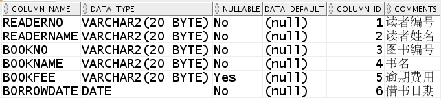
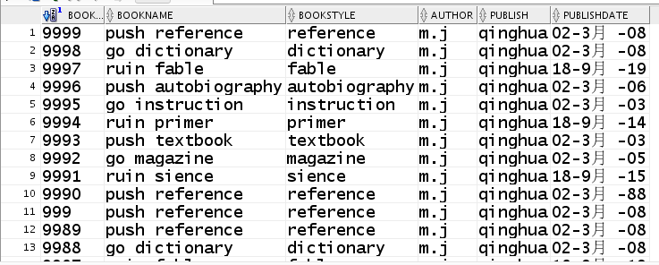
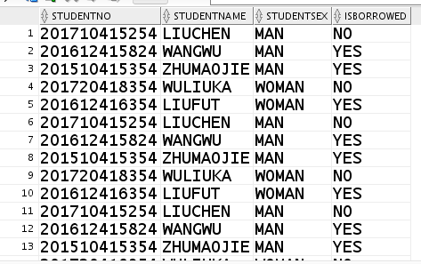
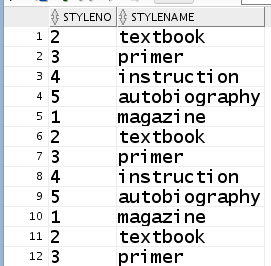
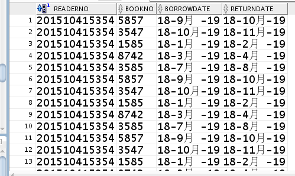
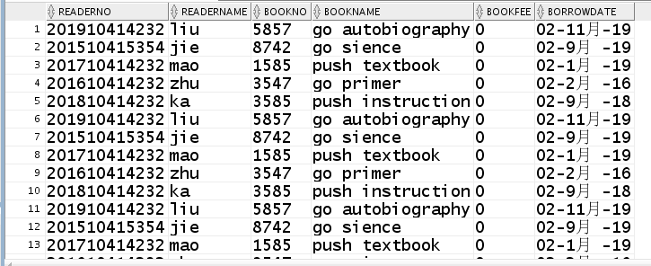
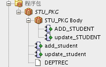
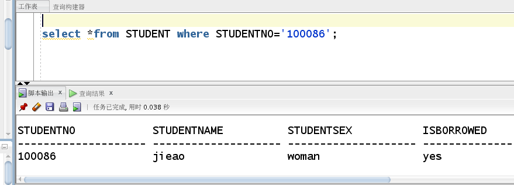
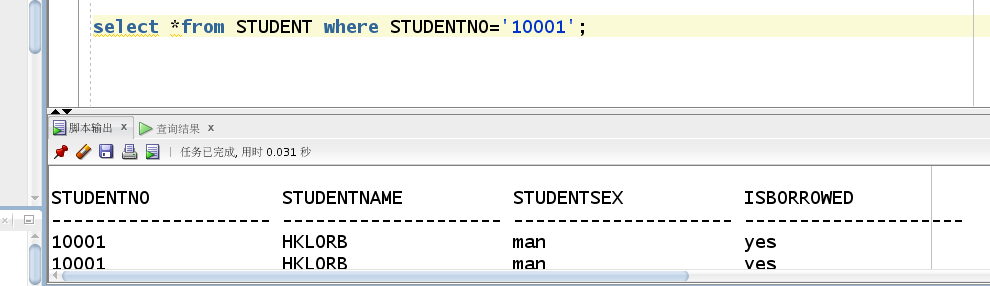

# 实验6（期末项目） 基于Oracle的大学生图书管理系统数据库设计 
##### 姓名：黄梁文韬
##### 学号：201810414114
##### 班级：18软工1班
##  1.设计权限及用户分配方案。至少两类角色，两个用户。 

**通过system账号连接数据库，创建角色stu_view、mgr_view和用户student、manager，并授权和分配空间： **

```sql
CREATE ROLE stu_view;
GRANT connect,resource,CREATE VIEW TO stu_view;
CREATE USER student IDENTIFIED BY 123 DEFAULT TABLESPACE users TEMPORARY TABLESPACE temp;
ALTER USER student QUOTA 500M ON users;
GRANT stu_view TO student;
```

```sql
CREATE ROLE mgr_view;
GRANT connect,resource,CREATE VIEW TO mgr_view;
CREATE USER manager IDENTIFIED BY 123 DEFAULT TABLESPACE users TEMPORARY TABLESPACE temp;
ALTER USER manager QUOTA 500M ON users;
GRANT mgr_view TO manager;
```

## 2. 设计项目涉及的表及表空间使用方案。至少5张表和5万条数据，两个表空间。

### 2.1创建学生图书管理系统的5张表

（1）学生借书还书表BORROWRETURN_BOOK

```sql
CREATE TABLE BORROWRETURN_BOOK 
(
  READERNO VARCHAR2(20) NOT NULL 
, BOOKNO VARCHAR2(20) NOT NULL 
, BORROWDATE VARCHAR2(20) NOT NULL 
, RETURNDATE VARCHAR2(20) NOT NULL 
);
```


(2)逾期费用表READER_FEE

```sql
CREATE TABLE READER_FEE 
(
  READERNO VARCHAR2(20) NOT NULL 
, READERNAME VARCHAR2(20) NOT NULL 
, BOOKNO VARCHAR2(20) NOT NULL 
, BOOKNAME VARCHAR2(20) NOT NULL 
, BOOKFEE VARCHAR2(20) NOT NULL 
, BORROWDATE DATE NOT NULL 
);
```



(3)图书信息表BOOK_infor

```sql
CREATE TABLE BOOK_infor
(
BOOKNO VARCHAR(20) NOT NULL,
BOOKNAME VARCHAR(20) NOT NULL,
BOOKSTYLE VARCHAR(20) NOT NULL,
AUTHOR VARCHAR(20) NOT NULL,
publish VARCHAR(20) NOT NULL,
publishdate DATE NOT NULL
)
```


(4)图书种类表

```sql
CREATE TABLE "MANAGER"."BOOK_STYLE" 
   (	
    "STYLENO" VARCHAR2(20 BYTE) NOT NULL ENABLE, 
	"STYLENAME" VARCHAR2(20 BYTE) NOT NULL ENABLE
   ) 
```


(5)学生信息表

```sql
CREATE TABLE STUDENT 
(
  STUDENTNO VARCHAR2(20) NOT NULL 
, STUDENTNAME VARCHAR2(20) 
, STUDENTSEX VARCHAR2(20) 
, STUDENTDATE VARCHAR2(20) 
, CONSTRAINT STUDENT_PK PRIMARY KEY 
  (
    STUDENTNO 
  )
  ENABLE 
);

```


### 2.2设计创建表的表空间

范围分区将数据基于范围映射到每一个分区，这个范围是你在创建分区时指定的分区键决定的。这种分区方式是最为常用的，并且分区键经常采用日期。当使用范围分区时，请考虑以下几个规则：

1）每一个分区都必须有一个VALUES LESS THEN子句，它指定了一个不包括在该分区中的上限值。分区键的任何值等于或者大于这个上限值的记录都会被加入到下一个高一些的分区中。
2）所有分区，除了第一个，都会有一个隐式的下限值，这个值就是此分区的前一个分区的上限值。
3）在最高的分区中，MAXVALUE被定义。MAXVALUE代表了一个不确定的值。这个值高于其它分区中的任何分区键的值，也可以理解为高于任何分区中指定的VALUE LESS THEN的值，同时包括空值。

（1） 使用system用户给用户账号分配上述分区的使用权限。使用system给用户分配可以查询执行计划的权限。 分区表的设计：例如图书信息表中的三个依靠时间划分的分区：sql语句如下

```sql
PARTITION BY RANGE (publishdate)
(
	PARTITION ORD_ACT_PART01 VALUES LESS THAN (TO_DATE('2000-01-01 00:00:00', 'SYYYY-MM-DD HH24:MI:SS', 'NLS_CALENDAR=GREGORIAN')) TABLESPACE USERS,
    PARTITION ORD_ACT_PART01 VALUES LESS THAN (TO_DATE('2005-01-01 00:00:00', 'SYYYY-MM-DD HH24:MI:SS', 'NLS_CALENDAR=GREGORIAN')) TABLESPACE USERS,
	PARTITION ORD_ACT_PART02 VALUES LESS THAN (TO_DATE('2010-01-01 00:00:00', 'SYYYY-MM-DD HH24:MI:SS', 'NLS_CALENDAR=GREGORIAN')) TABLESPACE USERS02,
    PARTITION ORD_ACT_PART02 VALUES LESS THAN (TO_DATE('2015-01-01 00:00:00', 'SYYYY-MM-DD HH24:MI:SS', 'NLS_CALENDAR=GREGORIAN')) TABLESPACE USERS02,
	PARTITION ORD_ACT_PART03 VALUES LESS THAN (TO_DATE('2020-01-01 00:00:00', 'SYYYY-MM-DD HH24:MI:SS', 'NLS_CALENDAR=GREGORIAN')) TABLESPACE USERS03
)

```

将时间段2000之前，2000~2015，2015以后来划分分区，设计分区表。


### 2.3向5个表中分别插入1万条数据

（1）图书信息表：

```sql
declare
    j NUMBER;
    begin
    j:=1;
    for i in  1..1000
    loop
        insert into BOOK_INFOR(BOOKNO,BOOKNAME,BOOKSTYLE,AUTHOR,PUBLISH,PUBLISHDATE) values(j,'ruin sience','sience','m.j','qinghua',to_date('2015-09-18','yyyy-mm-dd'));j:=j+1;
        insert into BOOK_INFOR(BOOKNO,BOOKNAME,BOOKSTYLE,AUTHOR,PUBLISH,PUBLISHDATE) values(j,'go magazine','magazine','m.j','qinghua',to_date('2005-3-2','yyyy-mm-dd'));j:=j+1;
        insert into BOOK_INFOR(BOOKNO,BOOKNAME,BOOKSTYLE,AUTHOR,PUBLISH,PUBLISHDATE) values(j,'push textbook','textbook','m.j','qinghua',to_date('1903-3-2','yyyy-mm-dd'));j:=j+1;
        insert into BOOK_INFOR(BOOKNO,BOOKNAME,BOOKSTYLE,AUTHOR,PUBLISH,PUBLISHDATE) values(j,'ruin primer','primer','m.j','qinghua',to_date('2014-09-18','yyyy-mm-dd'));j:=j+1;
        insert into BOOK_INFOR(BOOKNO,BOOKNAME,BOOKSTYLE,AUTHOR,PUBLISH,PUBLISHDATE) values(j,'go instruction','instruction','m.j','qinghua',to_date('2003-3-2','yyyy-mm-dd'));j:=j+1;
        insert into BOOK_INFOR(BOOKNO,BOOKNAME,BOOKSTYLE,AUTHOR,PUBLISH,PUBLISHDATE) values(j,'push autobiography','autobiography','m.j','qinghua',to_date('1906-3-2','yyyy-mm-dd'));j:=j+1;
        insert into BOOK_INFOR(BOOKNO,BOOKNAME,BOOKSTYLE,AUTHOR,PUBLISH,PUBLISHDATE) values(j,'ruin fable','fable','m.j','qinghua',to_date('2019-09-18','yyyy-mm-dd'));j:=j+1;
        insert into BOOK_INFOR(BOOKNO,BOOKNAME,BOOKSTYLE,AUTHOR,PUBLISH,PUBLISHDATE) values(j,'go dictionary','dictionary','m.j','qinghua',to_date('2008-3-2','yyyy-mm-dd'));j:=j+1;
        insert into BOOK_INFOR(BOOKNO,BOOKNAME,BOOKSTYLE,AUTHOR,PUBLISH,PUBLISHDATE) values(j,'push reference','reference','m.j','qinghua',to_date('1908-3-2','yyyy-mm-dd'));j:=j+1;
        insert into BOOK_INFOR(BOOKNO,BOOKNAME,BOOKSTYLE,AUTHOR,PUBLISH,PUBLISHDATE) values(j,'push reference','reference','m.j','qinghua',to_date('1988-3-2','yyyy-mm-dd'));j:=j+1;
    end loop;
    commit;
end;

```


(2)学生信息表：

```sql
begin
    for i in  1..2000
    loop
        insert into STUDENT(STUDENTNO,STUDENTNAME,STUDENTSEX,ISBORROWED) values('201510415354','ZHUMAOJIE','MAN','YES');
        insert into STUDENT(STUDENTNO,STUDENTNAME,STUDENTSEX,ISBORROWED) values('201720418354','WULIUKA','WOMAN','NO');
        insert into STUDENT(STUDENTNO,STUDENTNAME,STUDENTSEX,ISBORROWED) values('201612416354','LIUFUT','WOMAN','YES');
        insert into STUDENT(STUDENTNO,STUDENTNAME,STUDENTSEX,ISBORROWED) values('201710415254','LIUCHEN','MAN','NO');
        insert into STUDENT(STUDENTNO,STUDENTNAME,STUDENTSEX,ISBORROWED) values('201612415824','WANGWU','MAN','YES');
    end loop;
    commit;
end;


```

(3)图书种类表：

```sql
begin
    for i in  1..2000
    loop
        insert into book_style(STYLENO,STYLENAME) values('1','magazine');
        insert into book_style(STYLENO,STYLENAME) values('2','textbook');
        insert into book_style(STYLENO,STYLENAME) values('3','primer');
        insert into book_style(STYLENO,STYLENAME) values('4','instruction');
        insert into book_style(STYLENO,STYLENAME) values('5','autobiography');
    end loop;
    commit;
end;

```


(4)借书还书表：

```sql
begin
    for i in  1..2000
    loop
        insert into BORROWRETURN_BOOK(READERNO,BOOKNO,BORROWDATE,RETURNDATE) values('201510415354','8742',to_date('2019-9-2','yyyy-mm-dd'),to_date('2019-10-2','yyyy-mm-dd'));
       insert into BORROWRETURN_BOOK(READERNO,BOOKNO,BORROWDATE,RETURNDATE) values('201710415354','1585',to_date('2019-6-2','yyyy-mm-dd'),to_date('2019-7-2','yyyy-mm-dd'));
       insert into BORROWRETURN_BOOK(READERNO,BOOKNO,BORROWDATE,RETURNDATE) values('201810415354','3547',to_date('2019-3-2','yyyy-mm-dd'),to_date('2019-4-2','yyyy-mm-dd'));
       insert into BORROWRETURN_BOOK(READERNO,BOOKNO,BORROWDATE,RETURNDATE) values('201910415354','3585',to_date('2019-7-2','yyyy-mm-dd'),to_date('2019-8-2','yyyy-mm-dd'));
       insert into BORROWRETURN_BOOK(READERNO,BOOKNO,BORROWDATE,RETURNDATE) values('201710415354','5857',to_date('2019-3-2','yyyy-mm-dd'),to_date('2019-6-2','yyyy-mm-dd'));
    end loop;
    commit;
end;

```


(5)逾期费用表

```sql
begin
    for i in  1..2000
    loop
        insert into READER_FEE(READERNO,READERNAME,BOOKNO,BOOKNAME,BOOKFEE,BORROWDATE) values('201510415354','jie','8742','go sience','0',to_date('2019-9-2','yyyy-mm-dd'));
       insert into READER_FEE(READERNO,READERNAME,BOOKNO,BOOKNAME,BOOKFEE,BORROWDATE) values('201710414232','mao','1585','push textbook','0',to_date('2019-1-2','yyyy-mm-dd'));
       insert into READER_FEE(READERNO,READERNAME,BOOKNO,BOOKNAME,BOOKFEE,BORROWDATE) values('201610414232','zhu','3547','go primer','0',to_date('2016-2-2','yyyy-mm-dd'));
       insert into READER_FEE(READERNO,READERNAME,BOOKNO,BOOKNAME,BOOKFEE,BORROWDATE) values('201810414232','ka','3585','push instruction','0',to_date('2018-9-2','yyyy-mm-dd'));
       insert into READER_FEE(READERNO,READERNAME,BOOKNO,BOOKNAME,BOOKFEE,BORROWDATE) values('201910414232','liu','5857','go autobiography','0',to_date('2019-11-2','yyyy-mm-dd'));
    end loop;
    commit;
end;

```



## 3. 在数据库中建立一个程序包，在包中用PL/SQL语言设计一些存储过程和函数，实现比较复杂的业务逻辑，用模拟数据进行执行计划分析 

###  **程序包由规范和主体两部分组成** 

### 3.1包头的创建

```sql
create or replace PACKAGE  STU_PKG
IS
  DEPTREC STUDENT%ROWTYPE;
  FUNCTION add_student(
          student_no VARCHAR2, 
   student_name VARCHAR2, 
   student_sex  VARCHAR2, 
   stu_isborrowed  VARCHAR2)
  RETURN NUMBER;
  FUNCTION update_student(student_no VARCHAR2,
  stu_isborrowed  VARCHAR2
  )
  Return number;
END STU_PKG;

```

这里声明了两个函数，分别是增加学生信息，和修改学生借书信息。

### 3.2包体的创建

```sql
create or replace PACKAGE BODY STU_PKG
IS 
FUNCTION ADD_STUDENT
(
   student_no VARCHAR2, 
   student_name VARCHAR2, 
   student_sex  VARCHAR2, 
   stu_isborrowed  VARCHAR2
)
RETURN NUMBER
IS 
BEGIN
  INSERT INTO student VALUES( student_no, student_name, student_sex,stu_isborrowed);
  IF SQL%FOUND THEN
     RETURN 1;
  END IF;

END add_student;

FUNCTION update_STUDENT
(
   student_no VARCHAR2,  
   stu_isborrowed  VARCHAR2
)
RETURN NUMBER
IS 
BEGIN
  UPDATE student SET isborrowed = stu_isborrowed WHERE studentno = student_no;
  IF SQL%FOUND THEN
     RETURN 1;
  END IF;
END update_student;
END STU_PKG;

```

这里实现了包头中声明的两个函数的具体功能。



### 3.3测试结果如下

##### 增加学生信息：

```sql
DECLARE
    Var NUMBER;
BEGIN
    Var := STU_PKG.add_student('100086','jieao','woman','yes');
end;

```

##### 测试结果如图:




##### 修改学生借书信息：

```sql
DECLARE
    Var NUMBER;
BEGIN
    Var := STU_PKG.update_student('10001','yes');
    end;

```

##### 测试结果如图：



## 4.备份方案： 通过rman_level0.sh和rman_level1.sh脚本对数据库进行全备份和全恢复，在数据库出现异常时候，不损失任何数据！ 

### 4.1开始备份：

```sql
[oracle@oracle-pc ~]$ cat rman_level0.sh
[oracle@oracle-pc ~]$ ./rman_level0.sh

```

### 4.2查看备份文件：

```sql
[oracle@oracle-pc rman_backup]$ ls
arclv0_ORCL_20191126_9ouhrod2_1_1.bak  
dblv0_ORCL_20191126_9muhroas_1_1.bak  
lv0_20191120-143333_L0.log  
lv0_20191126-163131_L0.log
c-1392946895-20191126-00               
dblv0_ORCL_20191126_9nuhroc9_1_1.bak  
lv0_20191126-162254_L0.log  
lv1_20191111-003650_L0.log
dblv0_ORCL_20191126_9luhro8g_1_1.bak   
lv0_20191111-003303_L0.log            
lv0_20191126-162507_L0.log

```

- 其中 *.log是日志文件 
- dblv0*.bak是数据库的备份文件 
- arclv0*.bak是归档日期的备份文件 
- c-1392946895-20191120-01是控制文件和参数的备份 

### 4.3查看备份文件中的内容：

```sql
[oracle@oracle-pc ~]$ rman target /

Recovery Manager: Release 12.1.0.2.0 - Production on 星期二 11月 26 16:41:32 2019

Copyright (c) 1982, 2014, Oracle and/or its affiliates.  All rights reserved.

connected to target database: ORCL (DBID=1392946895)

RMAN> list backup;

using target database control file instead of recovery catalog

List of Backup Sets
===================


BS Key  Type LV Size       Device Type Elapsed Time Completion Time
------- ---- -- ---------- ----------- ------------ ---------------
261     Incr 0  216.86M    DISK        00:01:14     26-11月-19    
        BP Key: 261   Status: AVAILABLE  Compressed: YES  Tag: TAG20191126T163216
        Piece Name: /home/oracle/rman_backup/dblv0_ORCL_20191126_9luhro8g_1_1.bak
  List of Datafiles in backup set 261
  Container ID: 3, PDB Name: PDBORCL
  File LV Type Ckp SCN    Ckp Time   Name
  ---- -- ---- ---------- ---------- ----
  8    0  Incr 47448016   26-11月-19 /home/oracle/app/oracle/oradata/orcl/pdborcl/system01.dbf
  9    0  Incr 47448016   26-11月-19 /home/oracle/app/oracle/oradata/orcl/pdborcl/sysaux01.dbf
  10   0  Incr 47448016   26-11月-19 /home/oracle/app/oracle/oradata/orcl/pdborcl/SAMPLE_SCHEMA_users01.dbf
  11   0  Incr 47448016   26-11月-19 /home/oracle/app/oracle/oradata/orcl/pdborcl/example01.dbf
  12   0  Incr 47448016   26-11月-19 /home/oracle/app/oracle/oradata/orcl/pdborcl/pdbtest_users02_1.dbf
  13   0  Incr 47448016   26-11月-19 /home/oracle/app/oracle/oradata/orcl/pdborcl/pdbtest_users02_2.dbf
  16   0  Incr 47448016   26-11月-19 /home/oracle/app/oracle/oradata/orcl/pdborcl/pdbtest_users02_3.dbf
  17   0  Incr 47448016   26-11月-19 /home/oracle/app/oracle/oradata/orcl/pdborcl/pdbtest_users02_4.dbf
  77   0  Incr 47448016   26-11月-19 /home/oracle/app/oracle/oradata/orcl/pdborcl/pdbtest_users03_1.dbf
  78   0  Incr 47448016   26-11月-19 /home/oracle/app/oracle/oradata/orcl/pdborcl/pdbtest_users03_2.dbf

BS Key  Type LV Size       Device Type Elapsed Time Completion Time
------- ---- -- ---------- ----------- ------------ ---------------
262     Incr 0  368.41M    DISK        00:00:41     26-11月-19    
        BP Key: 262   Status: AVAILABLE  Compressed: YES  Tag: TAG20191126T163216
        Piece Name: /home/oracle/rman_backup/dblv0_ORCL_20191126_9muhroas_1_1.bak
  List of Datafiles in backup set 262
  File LV Type Ckp SCN    Ckp Time   Name
  ---- -- ---- ---------- ---------- ----
  1    0  Incr 47448137   26-11月-19 /home/oracle/app/oracle/oradata/orcl/system01.dbf
  3    0  Incr 47448137   26-11月-19 /home/oracle/app/oracle/oradata/orcl/sysaux01.dbf
  4    0  Incr 47448137   26-11月-19 /home/oracle/app/oracle/oradata/orcl/undotbs01.dbf
  6    0  Incr 47448137   26-11月-19 /home/oracle/app/oracle/oradata/orcl/users01.dbf

BS Key  Type LV Size       Device Type Elapsed Time Completion Time
------- ---- -- ---------- ----------- ------------ ---------------
263     Incr 0  157.08M    DISK        00:00:16     26-11月-19    
        BP Key: 263   Status: AVAILABLE  Compressed: YES  Tag: TAG20191126T163216
        Piece Name: /home/oracle/rman_backup/dblv0_ORCL_20191126_9nuhroc9_1_1.bak
  List of Datafiles in backup set 263
  Container ID: 2, PDB Name: PDB$SEED
  File LV Type Ckp SCN    Ckp Time   Name
  ---- -- ---- ---------- ---------- ----
  5    0  Incr 1819408    01-12月-14 /home/oracle/app/oracle/oradata/orcl/pdbseed/system01.dbf
  7    0  Incr 1819408    01-12月-14 /home/oracle/app/oracle/oradata/orcl/pdbseed/sysaux01.dbf

BS Key  Size       Device Type Elapsed Time Completion Time
------- ---------- ----------- ------------ ---------------
264     125.50K    DISK        00:00:00     26-11月-19    
        BP Key: 264   Status: AVAILABLE  Compressed: YES  Tag: TAG20191126T163442
        Piece Name: /home/oracle/rman_backup/arclv0_ORCL_20191126_9ouhrod2_1_1.bak

  List of Archived Logs in backup set 264
  Thrd Seq     Low SCN    Low Time   Next SCN   Next Time
  ---- ------- ---------- ---------- ---------- ---------
  1    1628    47447998   26-11月-19 47448173   26-11月-19

BS Key  Type LV Size       Device Type Elapsed Time Completion Time
------- ---- -- ---------- ----------- ------------ ---------------
265     Full    17.77M     DISK        00:00:01     26-11月-19    
        BP Key: 265   Status: AVAILABLE  Compressed: NO  Tag: TAG20191126T163443
        Piece Name: /home/oracle/rman_backup/c-1392946895-20191126-00
  SPFILE Included: Modification time: 26-11月-19
  SPFILE db_unique_name: ORCL
  Control File Included: Ckp SCN: 47448183     Ckp time: 26-11月-19

```

#### 由上面的"list backup;" 输出可以看出，备份集中的文件内容是：

- /home/oracle/rman_backup/dblv0_ORCL_20191120_d7uhb2ap_1_1.bak 是插接数据库PDBORCL的备份集
- /home/oracle/rman_backup/dblv0_ORCL_20191120_d8uhb2c6_1_1.bak 是ORCL的备份集
- /home/oracle/rman_backup/dblv0_ORCL_20191120_d9uhb2ei_1_1.bak是PDB$SEED的备份集
- /home/oracle/rman_backup/arclv0_ORCL_20191120_dauhb2fm_1_1.bak是归档文件的备份集
- /home/oracle/rman_backup/c-1392946895-20191120-01是参数文件(SPFILE)和控制文件(Control File)的备份集


### 4.4备份后修改数据：

```sql
[oracle@oracle-pc ~]$ sqlplus student/123@pdborcl

SQL*Plus: Release 12.1.0.2.0 Production on 星期三 11月 27 10:57:38 2019

Copyright (c) 1982, 2014, Oracle. All rights reserved. 

Last Successful login time: 星期二 11月 26 2019 20:15:04 +08:00

Connected to:

Oracle Database 12c Enterprise Edition Release 12.1.0.2.0 - 64bit Production

With the Partitioning, OLAP, Advanced Analytics and Real Application Testing options

Session altered. 

SQL> create table t1 (STUDENTNO number,name varchar2(50)); 

Table created.

SQL> insert into t1 values(1,'zhumaojie');

1 row created.

SQL> commit

 2 

SQL> commit;

Commit complete.

SQL> select *from t1;

 STUDENTNO NAME

---------- --------------------------------------------------

​     1 zhumaojie

 

SQL> exit

Disconnected from Oracle Database 12c Enterprise Edition Release 12.1.0.2.0 - 64bit Production

With the Partitioning, OLAP, Advanced Analytics and Real Application Testing options

 

```


### 4.5删除数据库文件，模拟数据库文件损坏：

```sql
[oracle@oraclepc~]$ rm/home/oracle/app/oracle/oradata/orcl/pdborcl/SAMPLE_SCHEMA_users01.dbf

```


### 4.6. 删除数据库文件后修改数据

删除数据文件后，仍然可以增加一条数据。这是因为增加的数据并没有写入数据文件，而是写到了日志文件中。如果增加的数据较多的时候，就会出问题了。例如下面的情况：

1).只向t1表中插入一个数据，结果成功，就是因为他把结果保存在日志文件中。

```sql
[oracle@oracle-pc ~]$ sqlplus student/123@pdborcl

SQL*Plus: Release 12.1.0.2.0 Production on 星期三 11月 27 11:03:37 2019

Copyright (c) 1982, 2014, Oracle. All rights reserved.

Last Successful login time: 星期三 11月 27 2019 10:57:38 +08:00

Connected to:

Oracle Database 12c Enterprise Edition Release 12.1.0.2.0 - 64bit Production

With the Partitioning, OLAP, Advanced Analytics and Real Application Testing options

Session altered.

SQL> insert into t1 values(2,'aoligei');

1 row created.

SQL> commit;

Commit complete.

SQL> select *from t1; 

 STUDENTNO NAME

---------- --------------------------------------------------

​     2 aoligei

​     1 zhumaojie

 

SQL>

2)但是当存储的数据超过了日志文件可以存储的大小，就会报错：

SQL> declare

 2 n number;

 3 begin

 4   for n in 1..10000 loop

 5    insert into t1 values(n,'name'||n);

 6   end loop;

 7 end;

 8 /

declare

*

ERROR at line 1:

ORA-01116: 打开数据库文件 10 时出错 ORA-01110:

数据文件 10: '/home/oracle/app/oracle/oradata/orcl/pdborcl/SAMPLE_SCHEMA_users01.dbf'

ORA-27041: 无法打开文件

Linux-x86_64 Error: 2: No such file or directory

Additional information: 3

ORA-06512: 在 line 5

 

```


### 4.7数据库完全恢复

重启损坏的数据库到mount状态

通过shutdown immediate无法正常关闭数据库，只能通过shutdown abort强制关闭。然后将数据库启动到mount状态。

 ```sql
[oracle@oracle-pc ~]$ sqlplus / as sysdba

SQL*Plus: Release 12.1.0.2.0 Production on 星期三 11月 27 11:15:13 2019

Copyright (c) 1982, 2014, Oracle. All rights reserved.

Connected to:

Oracle Database 12c Enterprise Edition Release 12.1.0.2.0 - 64bit Production

With the Partitioning, OLAP, Advanced Analytics and Real Application Testing options

Session altered.

SQL> shutdown immediate

ORA-01116: 打开数据库文件 10 时出错

ORA-0111数据文件 10:

'/home/oracle/app/oracle/oradata/orcl/pdborcl/SAMPLE_SCHEMA_users01.dbf'

ORA-27041: 无法打开文件

Linux-x86_64 Error: 2: No such file or directory

Additional information: 3

SQL> shutdown abort

ORACLE instance shut down.

SQL> startup mount

ORACLE instance started.

Total System Global Area 1577058304 bytes

Fixed Size         2924832 bytes

Variable Size       738201312 bytes

Database Buffers     654311424 bytes

Redo Buffers        13848576 bytes

In-Memory Area      167772160 bytes

Database mounted.

SQL> exit

Disconnected from Oracle Database 12c Enterprise Edition Release 12.1.0.2.0 - 64bit Production

With the Partitioning, OLAP, Advanced Analytics and Real Application Testing options

 ```


 

### 4.8 开始恢复数据库

```sql
[oracle@oracle-pc ~]$ rman target /

Recovery Manager: Release 12.1.0.2.0 - Production on 星期三 11月 27 11:26:51 2019

Copyright (c) 1982, 2014, Oracle and/or its affiliates. All rights reserved.

connected to target database: ORCL (DBID=1392946895, not open)

RMAN> restore database ;

Starting restore at 27-11月-19

using target database control file instead of recovery catalog

allocated channel: ORA_DISK_1

channel ORA_DISK_1: SID=243 device type=DISK

skipping datafile 5; already restored to file /home/oracle/app/oracle/oradata/orcl/pdbseed/system01.dbf

skipping datafile 7; already restored to file /home/oracle/app/oracle/oradata/orcl/pdbseed/sysaux01.dbf

channel ORA_DISK_1: starting datafile backup set restore

channel ORA_DISK_1: specifying datafile(s) to restore from backup set

channel ORA_DISK_1: restoring datafile 00008 to /home/oracle/app/oracle/oradata/orcl/pdborcl/system01.dbf

channel ORA_DISK_1: restoring datafile 00009 to /home/oracle/app/oracle/oradata/orcl/pdborcl/sysaux01.dbf

channel ORA_DISK_1: restoring datafile 00010 to /home/oracle/app/oracle/oradata/orcl/pdborcl/SAMPLE_SCHEMA_users01.dbf

channel ORA_DISK_1: restoring datafile 00011 to /home/oracle/app/oracle/oradata/orcl/pdborcl/example01.dbf

channel ORA_DISK_1: restoring datafile 00012 to /home/oracle/app/oracle/oradata/orcl/pdborcl/pdbtest_users02_1.dbf

channel ORA_DISK_1: restoring datafile 00013 to /home/oracle/app/oracle/oradata/orcl/pdborcl/pdbtest_users02_2.dbf

channel ORA_DISK_1: restoring datafile 00016 to /home/oracle/app/oracle/oradata/orcl/pdborcl/pdbtest_users02_3.dbf

channel ORA_DISK_1: restoring datafile 00017 to /home/oracle/app/oracle/oradata/orcl/pdborcl/pdbtest_users02_4.dbf

channel ORA_DISK_1: restoring datafile 00077 to /home/oracle/app/oracle/oradata/orcl/pdborcl/pdbtest_users03_1.dbf

channel ORA_DISK_1: restoring datafile 00078 to /home/oracle/app/oracle/oradata/orcl/pdborcl/pdbtest_users03_2.dbf

channel ORA_DISK_1: reading from backup piece /home/oracle/rman_backup/dblv0_ORCL_20191126_9luhro8g_1_1.bak

channel ORA_DISK_1: piece handle=/home/oracle/rman_backup/dblv0_ORCL_20191126_9luhro8g_1_1.bak tag=TAG20191126T163216

channel ORA_DISK_1: restored backup piece 1

channel ORA_DISK_1: restore complete, elapsed time: 00:01:16

channel ORA_DISK_1: starting datafile backup set restore

channel ORA_DISK_1: specifying datafile(s) to restore from backup set

channel ORA_DISK_1: restoring datafile 00001 to /home/oracle/app/oracle/oradata/orcl/system01.dbf

channel ORA_DISK_1: restoring datafile 00003 to /home/oracle/app/oracle/oradata/orcl/sysaux01.dbf

channel ORA_DISK_1: restoring datafile 00004 to /home/oracle/app/oracle/oradata/orcl/undotbs01.dbf

channel ORA_DISK_1: restoring datafile 00006 to /home/oracle/app/oracle/oradata/orcl/users01.dbf

channel ORA_DISK_1: reading from backup piece /home/oracle/rman_backup/dblv0_ORCL_20191126_9muhroas_1_1.bak

channel ORA_DISK_1: piece handle=/home/oracle/rman_backup/dblv0_ORCL_20191126_9muhroas_1_1.bak tag=TAG20191126T163216

channel ORA_DISK_1: restored backup piece 1

channel ORA_DISK_1: restore complete, elapsed time: 00:01:35

Finished restore at 27-11月-19

RMAN> recover database;

Starting recover at 27-11月-19

using channel ORA_DISK_1

starting media recovery

archived log for thread 1 with sequence 1628 is already on disk as file /home/oracle/app/oracle/fast_recovery_area/ORCL/archivelog/2019_11_26/o1_mf_1_1628_gxsrx2k9_.arc

archived log for thread 1 with sequence 1629 is already on disk as file /home/oracle/app/oracle/fast_recovery_area/ORCL/archivelog/2019_11_26/o1_mf_1_1629_gxtj53oo_.arc

archived log for thread 1 with sequence 1630 is already on disk as file /home/oracle/app/oracle/fast_recovery_area/ORCL/archivelog/2019_11_26/o1_mf_1_1630_gxtj9pp1_.arc

archived log file name=/home/oracle/app/oracle/fast_recovery_area/ORCL/archivelog/2019_11_26/o1_mf_1_1628_gxsrx2k9_.arc thread=1 sequence=1628

media recovery complete, elapsed time: 00:00:06

Finished recover at 27-11月-19

RMAN> alter database open;

Statement processed

RMAN> exit;

Recovery Manager complete.

```


### 4.9查询数据是否恢复

```sql
[oracle@oracle-pc ~]$ sqlplus student/123@pdborcl

SQL*Plus: Release 12.1.0.2.0 Production on 星期三 11月 27 11:40:12 2019

Copyright (c) 1982, 2014, Oracle. All rights reserved.

Last Successful login time: 星期三 11月 27 2019 11:03:37 +08:00

Connected to:

Oracle Database 12c Enterprise Edition Release 12.1.0.2.0 - 64bit Production

With the Partitioning, OLAP, Advanced Analytics and Real Application Testing options

Session altered.

SQL> select * from t1;

 STUDENTNO NAME

---------- --------------------------------------------------

​     2 aoligei

​     1 zhumaojie

```


## 项目总结及体会
   - 通过本学期Oracle的学习学习到了许多有关数据相关的处理方式，通过本门新课程也是了解到oracle一些使用及常识，其优点有：在数据库领域一直处于领先地位的产品。可以说Oracle数据库系统是目前世界上流行的关系数据库管理系统，系统可移植性好、使用方便、功能强，适用于各类大、中、小微机环境。它是一种高效率的、可靠性好的、适应高吞吐量的数据库方案。      
-  期末临近之际也是通过老师和同学的帮助设计并完成了本次这个小小的项目，本项目是个基于Oracle的学生图书管理系统的数据库设计与分析，是由我独立在一周的课余时间完成的，通过这个文档的编写，我也大体了解了项目数据库分析报告的构成部分，像什么E-R图，逻辑结构，实体集关系，物理结构等等，尤其是整体提升了数据库编码能力，对于我的这个学生图书管理系统的数据库设计，大体实现图书信息管理，学生信息管理，图书种类管理，逾期费用管理，但是还有很多细节的数据库设计没有实现，在一开始写数据库sql语句往往会因为一些小的问题耽误很久，像是某个字母写错，或者程序包理解不够，导致写存储过程时修改了很多很多次，最终还是成功了，这次的设计还是有很多的漏洞、不足，所以需要学习更加深入的知识，解决这些难题，才能让数据库设计更加完善，满足现实中的需要，这次期末项目加深理解了之前课上做的各个实验，同时也学到了很多课上没有学过的知识，理解了表空间分区的理由和作用，掌握使用程序包函数的操作等等，因此在学习新知识的同时也要温习旧知识，提高自己的能力。这学期的课程要结束了，我也还有许多不足之处，对于部分知识的掌握还不够熟练，之前学过数据库sqlsever的课程，很多知识放在Oracle中也同样实用，经过老师循序渐进的五个实验，让我了解了Oracle中的操作方法，这次实战项目也让我学到的得到了充分得运用。
- 最后，感谢赵老师的精心指导，由于老师有资深的企业经历，让我学到了很多，也感谢赵老师花费大量的时间监督我们按时完成实验作业，在我们遇到问题时老师也是细心对我们进行引导，最后解决问题，我也会一直自我督促自己按时完成自己的任务，感谢老师的付出，我在后面的学习也会谨记老师的话学习更多的知识，进一步的提升自己的能力。


## 评分标准

| 评分项     | 评分标准                     | 满分 |
| :--------- | :--------------------------- | :--- |
| 文档整体   | 文档内容详实、规范，美观大方 | 10   |
| 表设计     | 表，表空间设计合理，数据合理 | 20   |
| 用户管理   | 权限及用户分配方案设计正确   | 20   |
| PL/SQL设计 | 存储过程和函数设计正确       | 30   |
| 备份方案   | 备份方案设计正确             | 20   |
